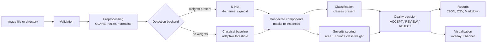
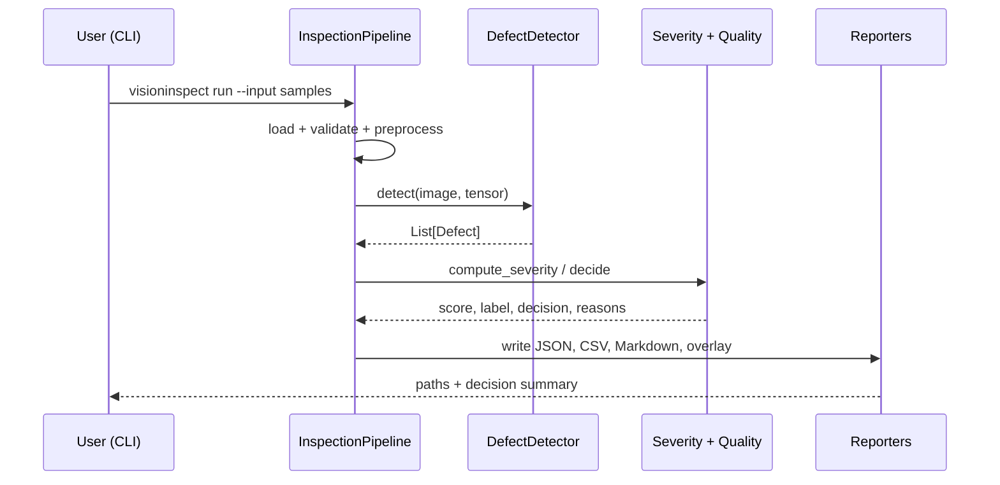
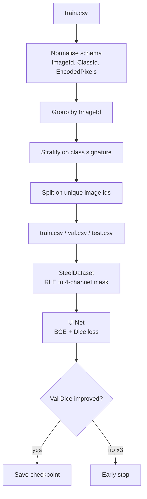
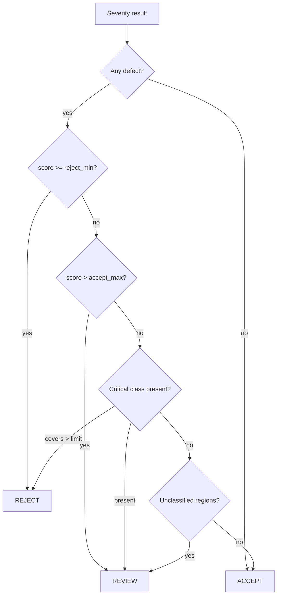

# Architecture

## 1. System overview



## 2. Module responsibilities

| Module | Responsibility | Input | Output |
|---|---|---|---|
| `config_loader` | Load and validate `config.yaml` | YAML path | `Config` |
| `preprocessing` | Reject bad images, enhance contrast, normalise | file path | BGR image, CHW tensor |
| `detector` | Pick a backend, produce defect instances | image, tensor | `List[Defect]` |
| `baseline_detector` | Training-free localisation | BGR image | `List[Defect]` (class 0) |
| `model` / `train` | U-Net definition and training loop | tensors, masks | checkpoint |
| `classifier` | Image-level labels from instances | `List[Defect]` | class ids, areas |
| `severity` | Weighted 0–100 score and band | defects, image size | `SeverityResult` |
| `quality_engine` | Decision plus written reasons | severity, defects | `QualityDecision` |
| `visualization` | Overlay, boxes, decision banner | image, result | PNG |
| `report_generator` | Machine- and human-readable reports | results | JSON, CSV, MD |
| `evaluate` / `metrics` | Held-out scoring | split CSV | Dice, IoU, P/R/F1 |
| `pipeline` | Orchestration and per-image error isolation | paths | `List[InspectionResult]` |

Stages communicate only through the dataclasses in `schemas.py`, so a backend can
be replaced without touching anything downstream.

## 3. Inference sequence



## 4. Data flow during training



Splitting happens on unique `ImageId`, never on annotation rows. An image with
two defect classes occupies two rows in `train.csv`; a row-level split would put
one row in train and the other in test, leaking the same pixels across the
boundary and inflating every reported metric.

## 5. Severity model

```
score = 100 × class_factor × (w_area × area_term + w_count × count_term)

area_term    = min(1, defect_area / image_area ÷ area_scale)
count_term   = min(1, defect_count ÷ count_saturation)
class_factor = max class weight present ÷ largest configured weight
```

Three properties matter and are enforced by tests: the score rises with defect
area, it rises with class weight at equal area, and it never exceeds 100.

Band edges (MINOR / MODERATE / SEVERE / CRITICAL) come from percentiles of the
score distribution over defective training images, computed by `calibrate`. Until
that runs, `severity.calibrated` stays `false` and every output is stamped
`UNCALIBRATED`.

## 6. Decision logic



Every branch appends a human-readable reason. A REJECT is never returned without
the trigger being stated in the report.

## 7. Error handling

A typed exception hierarchy (`VisionInspectError` → `ConfigError`, `DataError`,
`ImageValidationError`, `ModelError`, `PipelineError`) lets the CLI turn expected
failures into a one-line message and exit code 2, while unexpected failures keep
their traceback. Within a batch, one unreadable image is logged, recorded in the
report's "skipped inputs" table, and the run continues.
